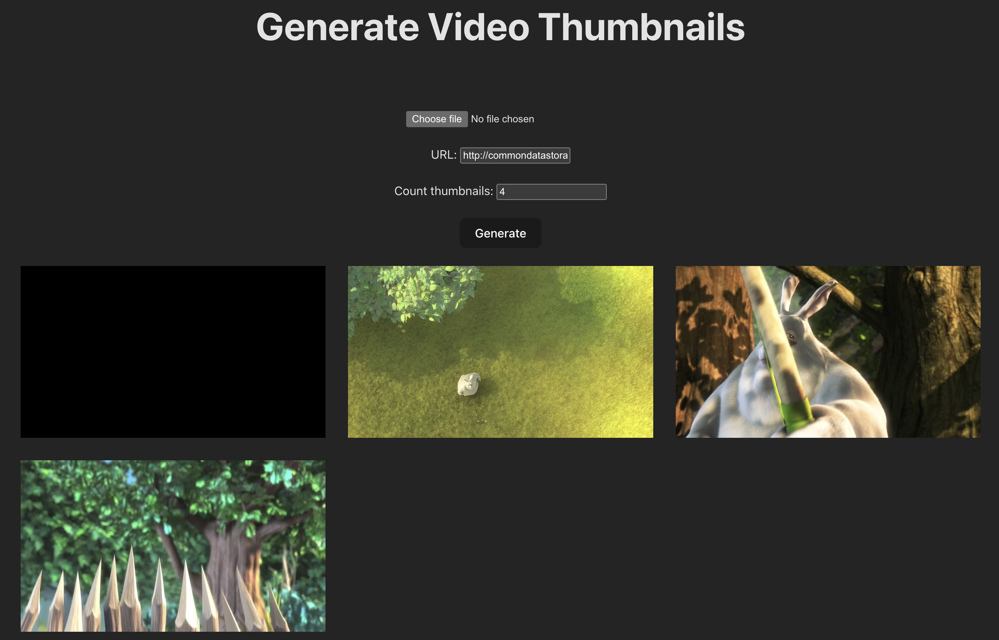

<p align="center">
<a href="https://www.npmjs.com/package/generate-video-thumbnail" target="_blank" rel="noopener noreferrer">
</a>
</p>

<p align="center">
  A library generate thumbnail from video 
</p>

<p align="center">
  <a href="https://www.npmjs.com/package/generate-video-thumbnail" target="_blank" rel="noopener noreferrer"></a>
  <a href="https://www.npmjs.com/package/generate-video-thumbnail" target="_blank" rel="noopener noreferrer"></a>
  <a href="https://bundlephobia.com/result?p=generate-video-thumbnail" target="_blank" rel="noopener noreferrer"></a>
  <a href="https://github.com/hunghg255/generate-video-thumbnail/graphs/contributors" target="_blank" rel="noopener noreferrer"></a>
  <a href="https://github.com/hunghg255/generate-video-thumbnail/blob/main/LICENSE" target="_blank" rel="noopener noreferrer"></a>
</p>

> Generate video thumbnails from a video file



## Install

```bash
npm install --save generate-video-thumbnail
```

## Usage

### `generateVideoThumbnails(selectedFile, numberOfThumbnails)`

#### Async/Await (Typescript & ES7)

```js
generateVideoThumbnails(videoFile, numberOfThumbnails)
  .then((thumbnailArray) => {
    // output will be arry of base64 Images
    // example - ["img1", "imgN"]
    // @todo - implement your logic here
  })
  .catch((err) => {
    console.error(err);
  });
```

### `generateVideoThumbnails(selectedFile, numberOfThumbnails, type, callback)`

#### Callback response (Typescript & ES7)

```js
const callback = (thumbnail, index) => {
  // thumbnail = base64 image
  // index = position on the final thumbnailArray
  // @todo - implement your logic here
};

generateVideoThumbnails(videoFile, numberOfThumbnails, type, callback)
  .then((thumbnailArray) => {
    // output will be arry of base64 Images
    // example - ["img1", "imgN"]
    // @todo - implement your logic here
  })
  .catch((err) => {
    console.error(err);
  });
```
